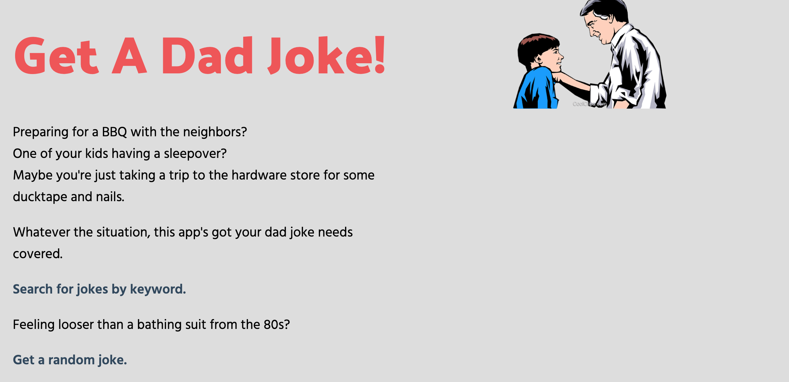
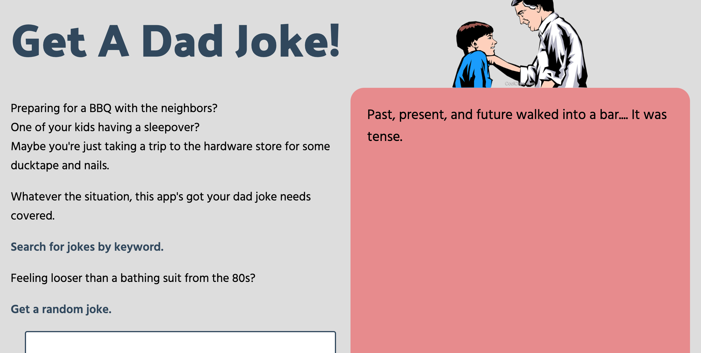
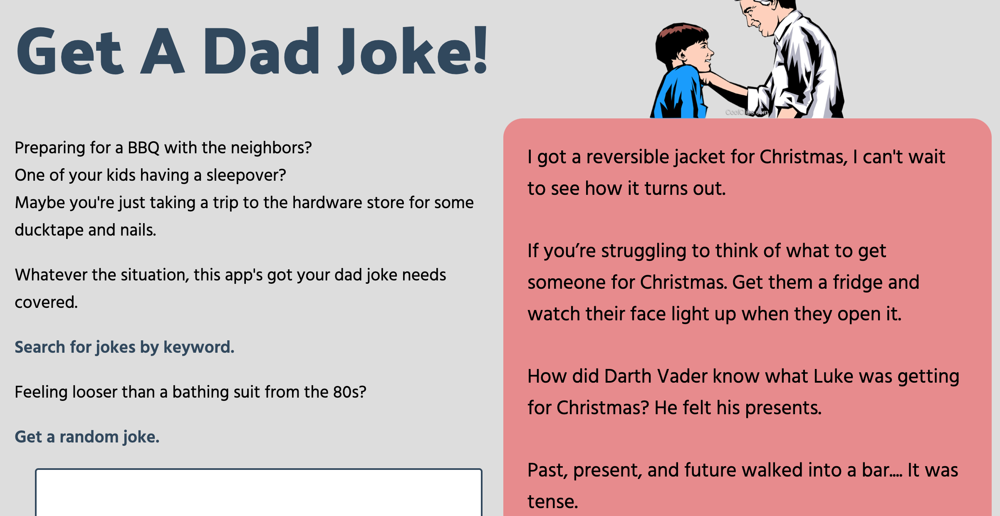

# Get A Dad Joke

This is a react app that pulls data from the icanhazdadjoke API. It was built as part of the completion of the second unit in my Software Engineering Immersive at General Assembly.

## Build Status
MVP complete. 

Post MVP features will be added after course completion. This may include:
 - Random joke of the day generated onload
 - Refactoring components to create more rendering flexibility

 ## Code Style & Framework
  - HTML, CSS, JS in React
  - CSS uses BEM and variables for efficiency
  - Mobile, tablet, and desktop responsive
  - Set state and fetched data from two endpoints. (see snippit)
```
//Searched Joke
  const [searchJoke, setSearchJoke] = React.useState(null)

  const getSearched = async (searchterm) => {
    const response = await fetch(`https://icanhazdadjoke.com/search?page=1&limit=5&term=${searchterm}`,{
        headers: {Accept: "application/json"}
    })
    const data = await response.json()
    setSearchJoke(data)
  }


  //Random Joke
  const [randomJoke, setRandomJoke]=React.useState(null)

  const getRandom= async () => {  
    const response = await fetch(`https://icanhazdadjoke.com`, {
      headers: {Accept: "application/json"}
    })
    const data = await response.json()
    setRandomJoke(data);
  }
```

 ## API

 - [I Can Haz Dad Joke API](https://icanhazdadjoke.com/api#search-for-dad-jokes)

Data fetched baised on search term

```
$ curl -H "Accept: application/json" "https://icanhazdadjoke.com/search?term=hipster"
{
  "current_page": 1,
  "limit": 20,
  "next_page": 1,
  "previous_page": 1,
  "results": [
    {
      "id": "GlGBIY0wAAd",
      "joke": "How much does a hipster weigh? An instagram."
    },
    {
      "id": "xc21Lmbxcib",
      "joke": "How did the hipster burn the roof of his mouth? He ate the pizza before it was cool."
    }
  ],
  "search_term": "hipster",
  "status": 200,
  "total_jokes": 2,
  "total_pages": 1
}
```

Data fetched randomly
```
$ curl -H "Accept: application/json" https://icanhazdadjoke.com/
{
  "id": "R7UfaahVfFd",
  "joke": "My dog used to chase people on a bike a lot. It got so bad I had to take his bike away.",
  "status": 200
}
```
## Screenshots (desktop)

Onload 


Search Form and Random Button


Random Joke Render


Searched Joke Render


## Credit
Many thanks to [Alex Merced](https://meet.alexmercedcoder.com/), my instructor for helping me through the most challenging parts in React.
